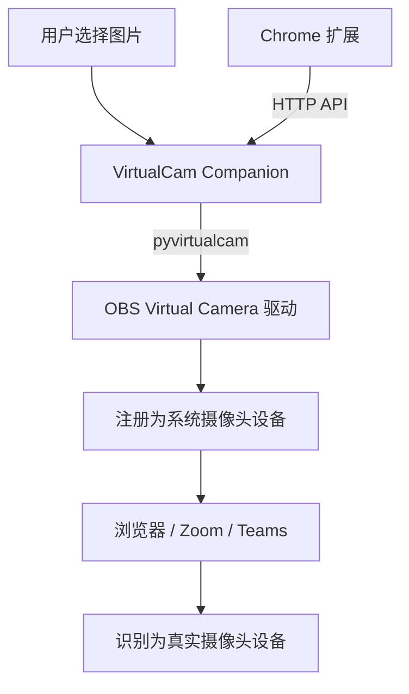
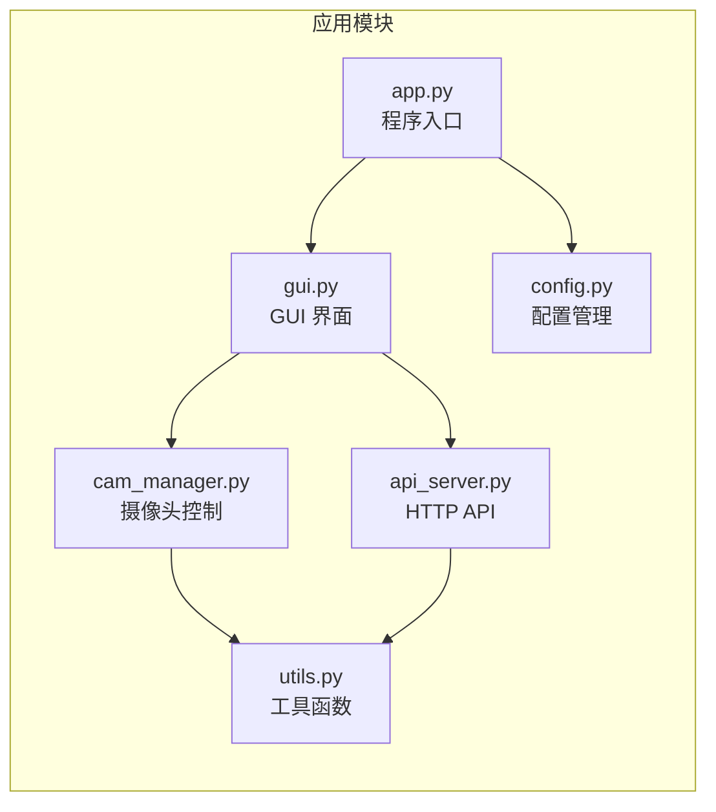

<div align="center">

# VirtualCam Companion

**系统级虚拟摄像头工具 -- 让任何网页/软件都能检测到虚拟摄像头**

[](https://github.com/GreenhandTan/virtual-cam-companion/stargazers)
[](https://opensource.org/licenses/MIT)
[](https://github.com/GreenhandTan/virtual-cam-companion/releases/latest)
[](https://github.com/GreenhandTan/virtual-cam-companion/releases)


</div>

---

## 功能特性

- **系统级虚拟摄像头** -- 在 Windows 摄像头列表中注册虚拟设备，任何软件都能识别
- **图片输出** -- 支持 JPG / PNG / BMP / WebP 格式图片作为摄像头画面
- **HTTP API** -- 内置 REST API（端口 5566），可被 Chrome 扩展远程调用
- **一体化安装** -- 安装包内置 OBS Virtual Camera 驱动，无需额外安装
- **可视化界面** -- 基于 tkinter 的深色 GUI，支持图片预览和状态监控

## 快速开始

### 下载安装

1. 前往 [Releases](https://github.com/GreenhandTan/virtual-cam-companion/releases/latest) 下载 `VirtualCamCompanion-Setup.exe`
2. 双击安装（自动注册虚拟摄像头驱动）
3. 安装完成后自动启动

### 使用方法

1. 点击 **选择图片** 加载要显示的画面
2. 点击 **启动摄像头**
3. 打开浏览器 / Zoom / Teams，选择 **OBS Virtual Camera** 作为摄像头
4. 网页/软件看到的就是你选择的图片

### 配合 Chrome 扩展使用

1. 先启动本程序（HTTP API 自动监听 `127.0.0.1:5566`）
2. 安装 [VirtualCam Extension](https://github.com/GreenhandTan/virtual-cam-extension)
3. 在扩展中选择图片，自动发送到本程序，虚拟摄像头输出该画面

## 工作原理





## HTTP API

程序启动后自动开启 HTTP 服务，供 Chrome 扩展调用：

| 接口 | 方法 | 说明 |
|------|------|------|
| `/api/ping` | GET | 检测程序是否运行 |
| `/api/status` | GET | 获取运行状态（是否启动、设备名、是否有图片） |
| `/api/set_image` | POST | 发送图片（body: `{"image": "base64..."}`） |
| `/api/start` | POST | 启动虚拟摄像头 |
| `/api/stop` | POST | 停止虚拟摄像头 |

## 技术栈

| 类别 | 技术 |
|------|------|
| 语言 | Python 3.8+ |
| GUI | tkinter |
| 虚拟摄像头 | pyvirtualcam + OBS Virtual Camera |
| 图片处理 | OpenCV, Pillow |
| 网络通信 | HTTP Server (内置) |
| 打包 | PyInstaller (单文件 exe) |
| 安装包 | Inno Setup |
| CI/CD | GitHub Actions |

## 项目结构

```
virtual-cam-companion/
├── app.py                    # 程序入口
├── config.py                 # 配置管理模块
├── cam_manager.py            # 虚拟摄像头核心模块
├── api_server.py             # HTTP API 服务模块
├── gui.py                    # GUI 界面模块
├── utils.py                  # 工具函数（日志、验证等）
├── config.json               # 用户配置文件（运行时生成）
├── requirements.txt          # Python 依赖
├── setup.iss                 # Inno Setup 安装包脚本
├── LICENSE                   # MIT 开源协议
├── README.md                 # 本文档
├── scripts/
│   ├── extract_obs_vcam.ps1  # 从 OBS 安装包提取虚拟摄像头驱动
│   └── extract_driver.py     # 从 pyvirtualcam 提取驱动（备用）
└── .github/workflows/
    └── build.yml             # GitHub Actions 自动构建
```

## 开发

### 环境准备

```bash
# 克隆项目
git clone https://github.com/GreenhandTan/virtual-cam-companion.git
cd virtual-cam-companion

# 安装依赖
pip install pyvirtualcam opencv-python Pillow

# 运行
python app.py
```

### 自动构建

项目使用 GitHub Actions 自动打包：

- 手动触发：Actions 页面 -> Run workflow
- 发版触发：`git tag v2.0.1 && git push origin v2.0.1`

构建产物：`VirtualCamCompanion-Setup.exe`（含虚拟摄像头驱动的一体化安装包）

## 常见问题

**Q: 浏览器中看不到虚拟摄像头？**

确保先在程序中点击"启动摄像头"，然后刷新网页。

**Q: 图片显示变形？**

虚拟摄像头输出为 1280x720，图片会被拉伸适配。建议使用 16:9 比例的图片。

**Q: 安装后摄像头设备不出现？**

安装包已内置 OBS Virtual Camera 驱动，安装时自动注册。如果未生效，请尝试重启电脑。

**Q: 支持哪些平台？**

目前仅支持 Windows 10/11（64位）。macOS 和 Linux 暂不支持。

## 开源协议

本项目基于 [MIT License](LICENSE) 开源。

---

<div align="center">

[Report Bug](https://github.com/GreenhandTan/virtual-cam-companion/issues) | [Request Feature](https://github.com/GreenhandTan/virtual-cam-companion/issues) | [Download](https://github.com/GreenhandTan/virtual-cam-companion/releases/latest)

</div>
